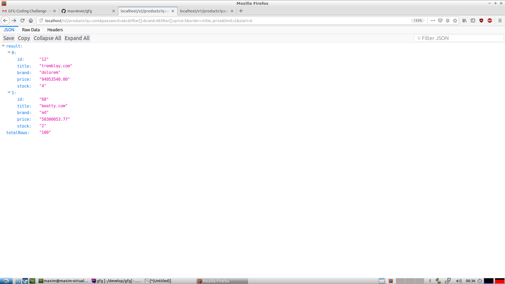

# Start docker

```bash
docker-compose up -d #build and start
```
## Open the Application

Open in the browser [http://localhost/v2/products](http://localhost/v2/products?q=.com&password=abc&filter[]=brand:d&filter[]=price:5&order=+title,-price&limit=2&start=0)


## Run tests

```bash
./run_tests.sh
```

## Graphical interface
Use the browser firefox like this

Or just use Postman